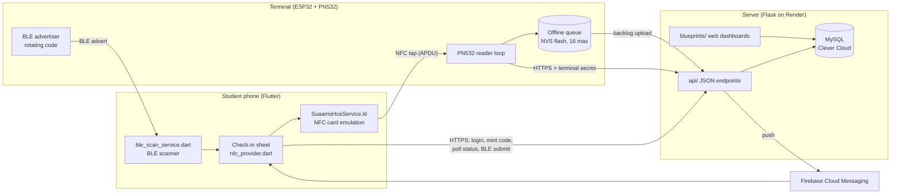
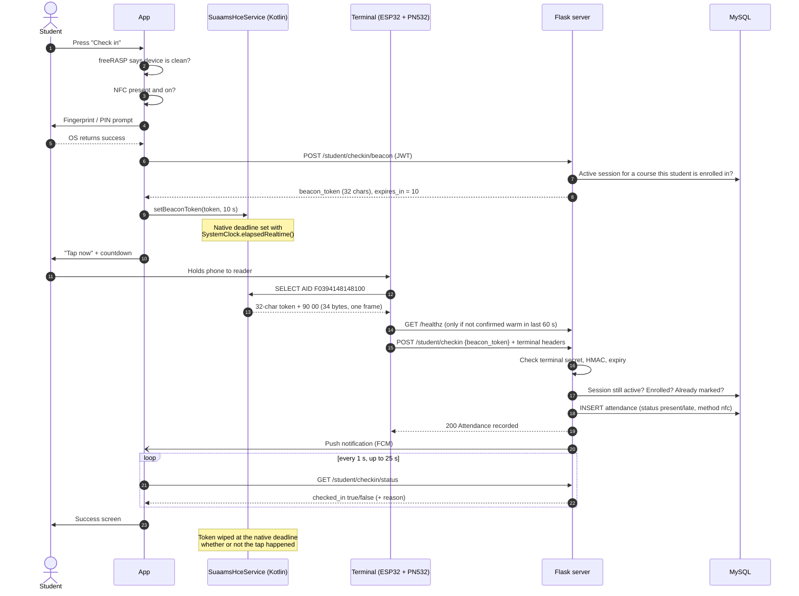
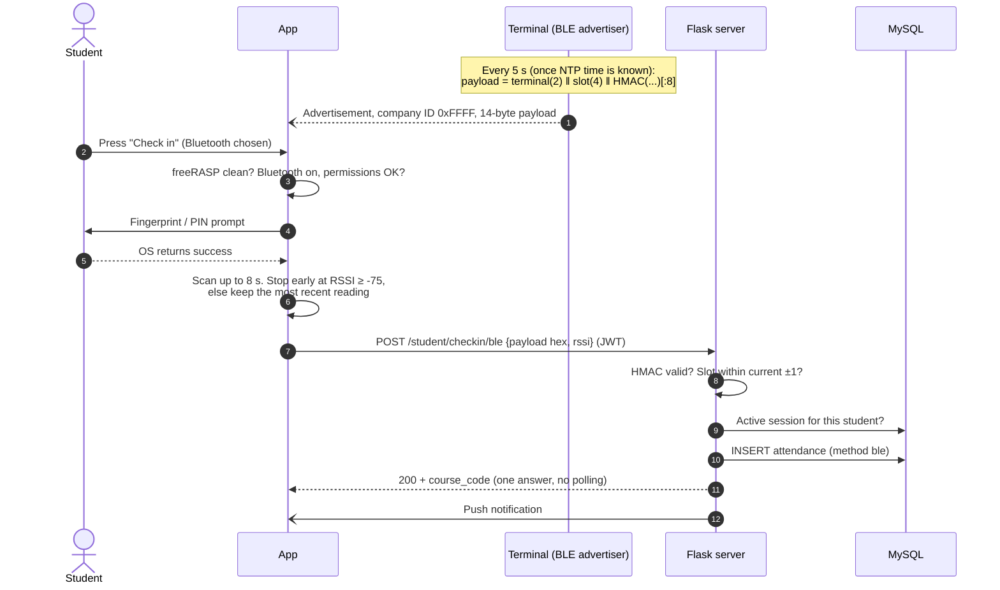
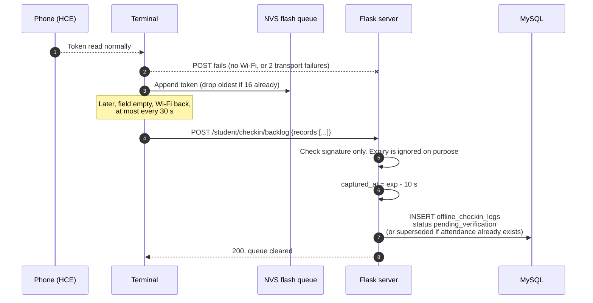
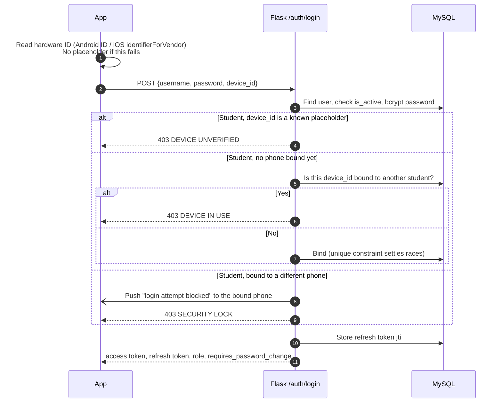

# SUAAMS Architecture

How the parts fit together and what happens, step by step, on each path.
The diagrams use Mermaid, which GitHub renders directly.

> **If you only remember five things**
>
> 1. **Three parts.** The Flutter app on the student's phone, an ESP32 + PN532
>    terminal at the door, and a Flask + MySQL server on Render.
> 2. **The 34-byte signed code.** The phone holds a 32-character code
>    (student, session, expiry, plus a 12-byte HMAC signature). It crosses NFC
>    in one exchange with a 2-byte status word, about 0.1 s. Only the server
>    can make or check one.
> 3. **Device binding.** One student account works on one phone, and one phone
>    can hold one student account. Only an admin can undo the binding.
> 4. **The 10-second window.** A code is dead 10 seconds after the server
>    mints it. The phone, the terminal and the server all respect that.
> 5. **NFC is stronger evidence than BLE.** NFC needs the phone within about
>    4 cm of the reader. A BLE code can be heard across a room and passed on.
>    That's why BLE is the fallback, and why every attendance row records
>    `method`.

---

## 1. Components

| Part | Talks to | How it authenticates |
|---|---|---|
| App → server | All `/api/v1/...` routes | JWT access token (30 min) + rotating refresh token (14 days) |
| Terminal → server | `/api/v1/student/checkin`, `/checkin/backlog`, `/healthz` | `X-Terminal-Id` + `X-Terminal-Secret` headers |
| Phone → terminal (NFC) | PN532 reads the phone | None by itself. The code it carries is signed by the server |
| Terminal → phone (BLE) | Phone listens to adverts | None by itself. The code is HMAC-signed with a secret shared by terminal and server |
| Browser → server | Web dashboards | Flask session cookie, bcrypt password, CSRF tokens, `login_required(role)` |

---

## 2. NFC check-in (main path, Android)

Points that are easy to forget:

- **The session is fixed at step 8**, not when the terminal posts. The
  terminal doesn't know which class it is serving.
- **Mint and status use the same helper** (`_active_session_for_student()` in
  [api/student.py](../SUAAMS/api/student.py)). If they disagreed, attendance
  would land but the app would poll forever.
- **The phone never learns the result over NFC.** NFC is one-way, so the app
  polls `/checkin/status`. "Unconfirmed" means *unknown*, not *failed*.
- **If the phone has no code armed**, it answers `6A 88`. The terminal treats
  that as "nothing to do", not an error.
- **"Late"** means more than 10 minutes after `planned_start`
  (`LATE_GRACE_MINUTES` in [utils.py](../SUAAMS/utils.py)), compared in campus
  time. With no `planned_start`, it's always `present`.

---

## 3. Bluetooth check-in (fallback, Android and iPhone)

The direction is reversed. The terminal broadcasts and the phone listens.

- The server accepts the current slot, one behind and one ahead. That is
  about 10 seconds of validity, plus tolerance for a terminal clock running
  slightly fast.
- RSSI is logged and used to tell the student "move closer". It **never**
  decides acceptance, because the phone reports it and could fake it.
- If `BLE_BEACON_SECRET` is unset on the server, `/checkin/methods` reports
  `ble: false` and the app hides the option.

---

## 4. Terminal offline

These rows are **not attendance**. A lecturer has to decide on them, and the
review screen isn't built yet.

The terminal only treats a request as "offline" when it gets **no HTTP
response at all**. A real 4xx/5xx is the server's answer, so that tap is not
queued.

---

## 5. Login and device binding

- Lecturers and HODs are not bound to a device.
- `/auth/refresh` rotates both tokens. The old refresh token stops working
  because its `jti` no longer matches `users.current_refresh_jti`. Logout
  clears it.
- The app retries any 401 once after a silent refresh
  ([auth_retry.dart](../SUAAMS_Mobile/suaams/lib/core/network/auth_retry.dart)).
- Unbinding is an admin action on the web dashboard
  (`POST /admin/students/unbind/<id>`).

---

## 6. Class sessions

A lecturer starts a session from the app
(`POST /lecturer/course/<id>/start-session`) or the web dashboard. This
creates a `sessions` row with `is_active = true` and an optional
`planned_start`/`planned_end`. Check-in only works while a session is active.
Ending it sets `is_active = false`. A tap that arrives after that gets
`409 That session has ended`.

Nothing starts or ends sessions automatically yet. The admin timetable page
shows a "Happening Now" banner for the class that *should* be running.

---

## 7. Data model (17 tables)

Defined in [models.py](../SUAAMS/models.py).

| Group | Tables |
|---|---|
| Organisation | `faculties`, `departments`, `semesters` |
| People | `users` (login, role, refresh jti), `students` (matric, `device_id` unique), `lecturers`, `hods` |
| Teaching | `courses` (unique per code + semester), `enrollments`, `timetable`, `sessions` |
| Attendance | `attendance` (unique per student + session, `status`, `method`), `offline_checkin_logs` (unique per student + session) |
| Comms | `announcements`, `notifications`, `device_tokens` (FCM) |
| Other | `results` |

Deletes cascade downwards (for example, deleting a session deletes its
attendance rows). Semesters deliberately do not cascade. See the comment in
`models.py`.

---

## 8. Time

- Class times (`planned_start`, timetable slots) are **campus wall-clock
  time**, Africa/Lagos ([campus_time.py](../SUAAMS/campus_time.py)).
- Moments (check-in time, token expiry) are **UTC / Unix time**.
- The NFC token's expiry is Unix time on the server. The terminal never reads
  it.
- The BLE slot is Unix time ÷ 5, so the terminal needs NTP. Until NTP answers,
  it broadcasts nothing.
